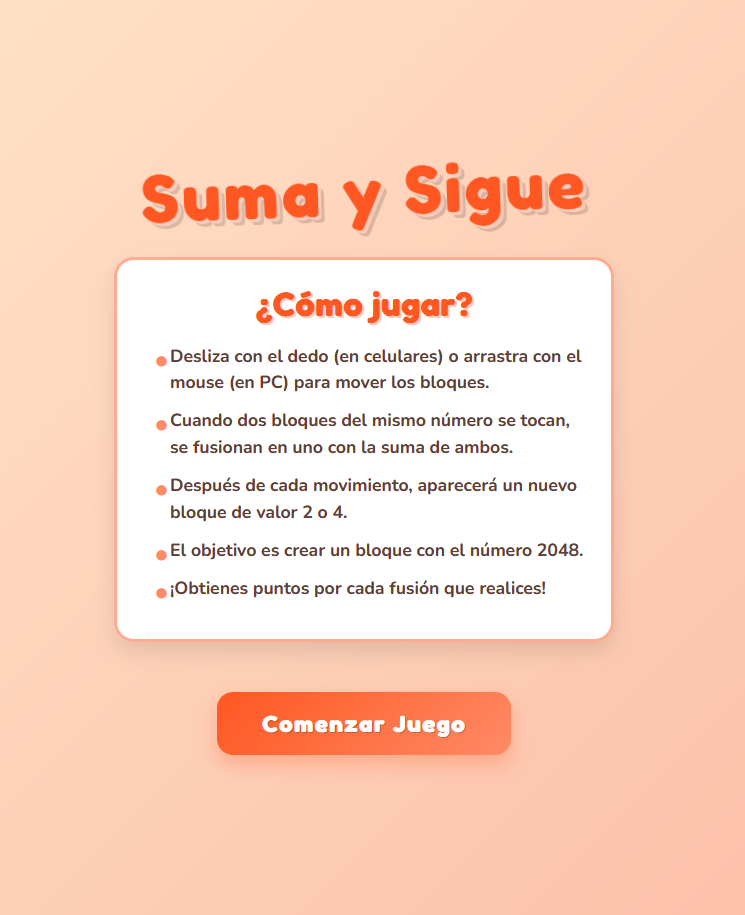

# 🔢 Suma y Sigue

Un juego inspirado en **2048**, desarrollado en **HTML, CSS y JavaScript puro**, con un diseño moderno, animaciones fluidas y totalmente responsivo.  
El objetivo es combinar bloques con el mismo número hasta alcanzar la ficha **2048**.  

## 🚀 Demo

## 📸 Captura de Pantalla

## 🎮 Características

- Pantalla de inicio con instrucciones claras.  
- Compatible con **PC (mouse/teclado)** y **móvil (gestos táctiles)**.  
- Animaciones en la aparición y fusión de bloques.  
- Sistema de puntuación dinámico.  
- Mensajes de **Victoria** (cuando logras 2048) y **Game Over**.  
- Diseño moderno con colores vibrantes y sombras suaves.  

## 📂 Estructura del proyecto
### SumaySigue/
### │── index.html
### │── css/
### ├── └── style.css 
### │── js/
### ├── └── game.js
### ├── preview.png 
### └── README.md  

## 🛠️ Tecnologías utilizadas

- **HTML5** → Estructura del juego.  
- **CSS3** → Estilos, gradientes, sombras y animaciones.  
- **JavaScript** → Lógica del juego y detección de movimientos (mouse y touch).  

## 📖 Cómo jugar

1. Desliza con el dedo (en móvil) o arrastra con el mouse (en PC) para mover los bloques.  
2. Cuando dos bloques con el mismo número se tocan, se combinan en uno con la suma de ambos.  
3. Después de cada movimiento aparece un nuevo bloque (2 o 4).  
4. El objetivo es alcanzar el **bloque 2048**.  
5. La partida termina cuando no hay más movimientos posibles.  

💡 **Tip:** aunque llegues a 2048, podés seguir jugando y alcanzar números aún mayores.  

## 📝 Licencia
Este proyecto está bajo la **MIT License**.  
Libre para usar, modificar y compartir.  

## ⭐ ¿Te gustó el proyecto?
¡Dejá una ⭐ en GitHub y compartilo!  
Este juego combina **diseño atractivo y lógica desafiante** con un clásico moderno.  

# ¡Gracias por jugar **Suma y Sigue**! 🎯✨  
